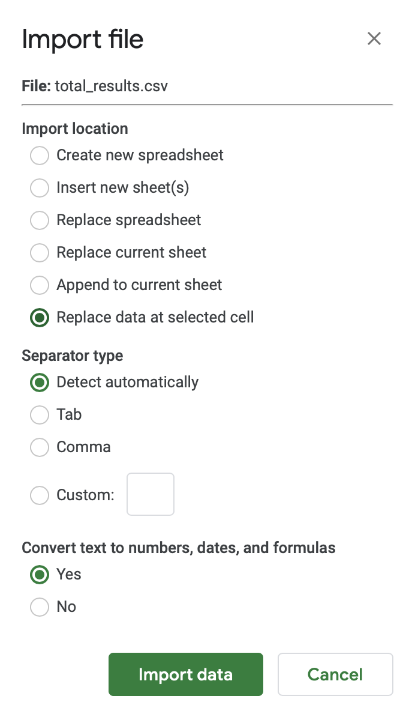

### Participation 4:

#### Name :
Your Name

#### Date :
1 Dec 2020

#### Instructions:
Please copy this file and its directory to your practicals repository.

#### Accompanying Questions

- Describe your initial interaction with the program? For instance, how easy was it to use and understand?

TODO

- After running the program to determine some basic output, what kind of analysis is being performed?

TODO

- The program attempted to assess your handedness. How often was the program correct? If mistakes were made, how did they happen?

TODO

- How did your behavior influence the the program's ability to guess your handedness?

TODO

- How is entering random letters on a keyboard similar to surfing the web in the way that your information is tracked?

TODO

- What kind of observation(s) of your online activity could be used to infer something about you?

TODO

  - What kinds of bias about you could be created by watching your online activity?

TODO

  - Can you think of a way to reduce potential biases in the algorithms making inferences about users? Do you feel the government should make companies more liable for incorrectly using and tracking user data?

TODO

## Other Information

How to import a `results.csv` file of a user's four trials saved from running the `qazplm.py` program:

(Did you remember to add your name and data to the top of this document?)
